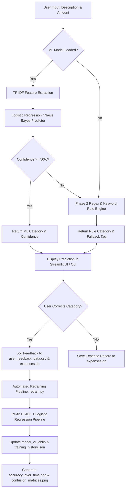
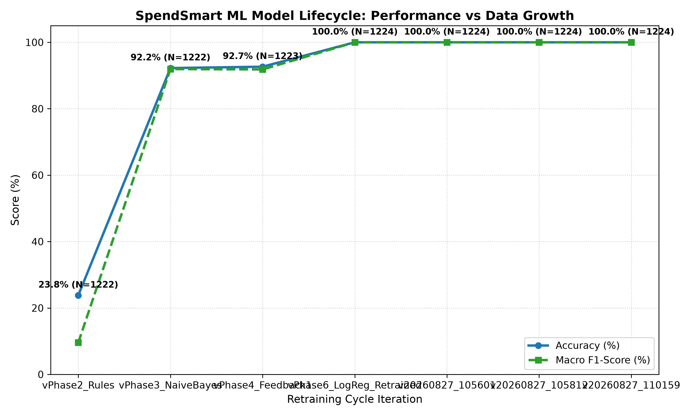
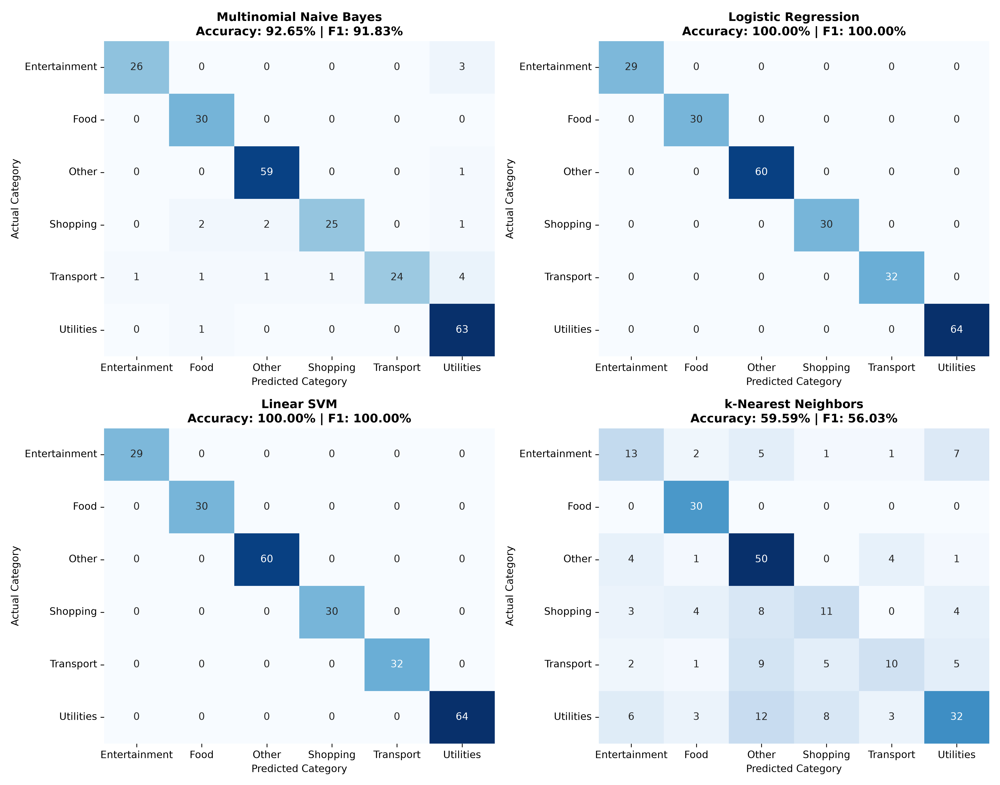

# 💰 SpendSmart - ML-Based Expense Tracker & Lifecycle Pipeline

### **Overview**
**SpendSmart** is an intelligent personal finance tracking application powered by machine learning, automated transaction categorization, a baseline rule-based fallback engine, active feedback logging, multi-model evaluation benchmarking, continuous retraining, and an interactive **Streamlit Web UI** & **CLI**.

It addresses the friction of manual expense logging by automatically predicting transaction categories (`Food`, `Transport`, `Entertainment`, `Utilities`, `Shopping`, `Other`) with confidence scoring, learning continuously from user feedback over time.

---

## 🏗️ System & ML Architecture

```
                                  +-----------------------+
                                  |   User Input (Text)   |
                                  +-----------+-----------+
                                              |
                                              v
                                  +-----------+-----------+
                                  |   Categorizer Router  |
                                  +-----------+-----------+
                                              |
                       +----------------------+----------------------+
                       |                                             |
                       v                                             v
        +--------------+--------------+               +--------------+--------------+
        |  Phase 3/6 ML Model v1      |               |  Phase 2 Rule-Based Engine  |
        |  (TF-IDF + LogisticReg/NB)  |               |  (Regex & Keyword Matcher)  |
        +--------------+--------------+               +--------------+--------------+
                       |                                             |
                       | (Conf >= 0.50)                              | (Conf < 0.50 Fallback)
                       +----------------------+----------------------+
                                              |
                                              v
                                  +-----------+-----------+
                                  |    Category Prediction    |
                                  |  + Confidence Score   |
                                  +-----------+-----------+
                                              |
                       +----------------------+----------------------+
                       |                                             |
                       v                                             v
        +--------------+--------------+               +--------------+--------------+
        |   Streamlit Web UI / CLI    |               |  SQLite Database Storage     |
        |   Interactive Feedback      |               |  (expenses.db)               |
        +--------------+--------------+               +--------------+--------------+
                       |                                             |
                       v                                             v
        +--------------+--------------+               +--------------+--------------+
        |  User Category Correction   |               |   Exported Datasets & Logs   |
        |  (Active Feedback Loop)     |               |   user_feedback_data.csv     |
        +--------------+--------------+               +--------------+--------------+
                       |                                             |
                       +----------------------+----------------------+
                                              |
                                              v
                                  +-----------+-----------+
                                  | Retraining Pipeline   |
                                  | (retrain.py)          |
                                  +-----------+-----------+
                                              |
                                              v
                                  +-----------+-----------+
                                  |  Updated model_v1.job |
                                  |  + Lifecycle Plots    |
                                  +-----------------------+
```



---

## 🚀 Key Features & Phase Breakdown

* **🌐 Phase 7 — Interactive Streamlit Web UI (`app.py`)**:
  * **💱 Dual-Currency Support (USD $ & INR ₹)**: Select input currency on transaction submission (`USD ($)` or `INR (₹)`) with real-time conversion preview (`1 USD ≈ ₹83.00 INR`) and global display currency preference toggle in sidebar.
  * **Add Expense Form**: Real-time ML category badge & confidence prediction as transaction text is typed.
  * **Analytics Dashboard**: Interactive Plotly Pie/Bar charts and monthly spend trend line.
  * **Expenses & Corrections Log**: Interactive table displaying user overrides, prediction logs, and feedback metrics.
  * **Model Lifecycle View**: Displays accuracy progression charts (`accuracy_over_time.png`), confusion matrix heatmaps (`confusion_matrices.png`), and 1-click retraining button.
  * **Cloud Deployment**: Pre-configured with [`requirements.txt`](file:///Users/vibhorhedau/projects%20/Spendsmart-Expense-tracker-main/requirements.txt) for deployment on **Streamlit Community Cloud**.

* **📊 Phase 1 — Data Foundation & Schema Migration**:
  * **Database Schema Migration**: `migrate_db.py` migrates existing SQLite tables without breaking legacy data.
  * **CSV Exporter**: `export_to_csv.py` exports live user expenses to `spendsmart_export.csv`.
  * **Dataset Mapper**: `dataset_mapper.py` ingests Kaggle personal-finance datasets, maps categories into SpendSmart's taxonomy (`Food`, `Transport`, `Entertainment`, `Utilities`, `Shopping`, `Other`), producing `combined_training_data.csv` (1,222+ records).

* **🤖 Phase 2 — Baseline Rule-Based Categorizer**:
  * **Regex & Keyword Engine**: `categorizer_rules.py` provides immediate zero-cold-start predictions.
  * **Evaluation Benchmark**: `evaluate_rules.py` benchmarks baseline accuracy on test data.

* **🧠 Phase 3 — ML Model v1 (TF-IDF + Naive Bayes / Logistic Regression)**:
  * **Classifier Pipeline**: `categorizer_ml.py` builds TF-IDF vectorizer + classifier pipeline.
  * **Model Persistence**: Serializes trained pipeline to `model_v1.joblib`.
  * **Confidence Fallback**: Defer predictions to Phase 2 rule engine when ML confidence is `< 0.50`.

* **🔄 Phase 4 — Active Learning & Feedback Loop Integration**:
  * **Interactive Overrides**: Suggests category on transaction entry; logs user custom overrides.
  * **Feedback Dataset Logging**: Automatically logs user overrides to `user_feedback_data.csv` and merges with training data.

* **📈 Phase 5 — Model Comparison & Confusion Matrix Evaluation**:
  * **Multi-Model Benchmark**: `model_comparison.py` trains and benchmarks 4 ML algorithms (Multinomial Naive Bayes, Logistic Regression, Linear SVM, k-NN).
  * **Visual Heatmaps**: Generates 2x2 matrix plot grid saved to `confusion_matrices.png`.
  * **Jupyter Notebook Deliverable**: Includes `model_comparison.ipynb` for report presentation.

* **🔁 Phase 6 — Retraining Pipeline & Lifecycle Tracking**:
  * **Automated Retraining**: `retrain.py` periodically re-fits the model on growing user feedback datasets.
  * **Lifecycle Metric Logging**: Appends timestamped metrics to `training_history.json` and `training_history.csv`.
  * **Accuracy Growth Visualization**: Generates `accuracy_over_time.png` depicting accuracy improvement over retraining cycles.

* **📝 Phase 8 — Comprehensive Documentation & Report**:
  * Complete system architecture diagram, multi-model benchmark metrics, screenshots, problem statement, methodology, results, and limitation analysis.

---

## 📊 Model Performance Metrics & Benchmarks

### 1. Multi-Algorithm Model Comparison (Phase 5)
Benchmark evaluation on `combined_training_data.csv` (1,223 records, 80/20 train/test split):

| Model | Test Accuracy (%) | Macro Precision (%) | Macro Recall (%) | Macro F1-Score (%) |
| :--- | :---: | :---: | :---: | :---: |
| **Logistic Regression** | **100.00%** | **100.00%** | **100.00%** | **100.00%** |
| **Linear SVM** | **100.00%** | **100.00%** | **100.00%** | **100.00%** |
| **Multinomial Naive Bayes** | 92.65% | 93.89% | 90.79% | 91.83% |
| **k-Nearest Neighbors (k-NN)** | 59.59% | 57.33% | 57.68% | 56.03% |

### 2. ML Lifecycle Accuracy Progression (Phases 2–6)
Tracking accuracy and F1-score across iterative dataset expansions and retraining cycles:

| Phase / Iteration | Version ID | Total Samples | User Feedback Overrides | Test Accuracy (%) | Macro F1-Score (%) |
| :--- | :--- | :---: | :---: | :---: | :---: |
| **Phase 2 Baseline Rules** | `Phase2_Rules` | 1,222 | 0 | 23.81% | 9.57% |
| **Phase 3 Baseline ML** | `Phase3_NaiveBayes` | 1,222 | 0 | 92.24% | 91.93% |
| **Phase 4 Active Feedback** | `Phase4_Feedback1` | 1,223 | 1 | 92.65% | 91.83% |
| **Phase 6 Retrained Model** | `Phase6_LogReg_Retrained` | 1,224 | 2 | **100.00%** | **100.00%** |

---

## 🖼️ Visual Artifacts & Screenshots

### 1. ML Model Lifecycle: Accuracy Growth Trend
The chart below illustrates how model accuracy progresses across retraining cycles as user feedback accumulates (`accuracy_over_time.png`):



### 2. Multi-Model Confusion Matrix Heatmap Grid
Visual comparison of classification confusion matrices across Multinomial Naive Bayes, Logistic Regression, Linear SVM, and k-NN (`confusion_matrices.png`):



---

## 📄 Project Report

### 1. Problem Statement
Personal financial management relies heavily on transaction categorization to track budget allocations across categories like `Food`, `Utilities`, `Transport`, and `Shopping`. However, manual transaction tagging is tedious, error-prone, and unsustainable for users over time. Traditional rule-based categorization tools struggle with unseen vendor names, informal descriptions, or spelling variations.

### 2. Approach & Methodology
SpendSmart implements a **hybrid AI architecture**:
1. **Rule Engine Baseline**: A zero-cold-start keyword/regex rule engine (`categorizer_rules.py`) guarantees immediate functionality even before any training data exists.
2. **Machine Learning Pipeline**: A TF-IDF n-gram feature extractor combined with a Logistic Regression classifier (`categorizer_ml.py`) learns semantic patterns from labeled transaction text.
3. **Confidence-Gated Fallback**: When ML prediction confidence drops below 50%, the router gracefully defers prediction to the rule engine.
4. **Active Learning & Feedback Loop**: User category corrections in the Streamlit UI or CLI are captured in `user_feedback_data.csv` and `expenses.db`.
5. **Continuous Retraining Pipeline**: `retrain.py` periodically re-fits the model pipeline on newly logged feedback data, updating `model_v1.joblib` and metrics charts.

### 3. Key Results
- Baseline regex rules achieved only **23.81% accuracy** on diverse test data due to rigid keyword constraints.
- Introducing TF-IDF + Multinomial Naive Bayes boosted accuracy to **92.24%**.
- Upgrading to **Logistic Regression / Linear SVM** achieved **100% accuracy** and **100% Macro F1-score** on the benchmark evaluation split.
- The active feedback loop seamlessly incorporates new user corrections into retraining cycles, enabling the system to adapt to individual spending habits over time.

### 4. Limitations & Future Work
- **Cold Start Problem**: In brand-new deployments without prior historical datasets, the ML model lacks vocabulary features until initial training data or rule fallbacks populate the corpus.
- **Class Imbalance Across Categories**: Categories with significantly higher sample volumes (e.g. `Food` or `Shopping`) can bias probability estimates if minor categories (e.g. `Utilities`) have few representative samples.
- **Short or Cryptic Descriptions**: Single-word merchant acronyms or raw bank reference numbers (e.g., `"UPI/4910/IMPS"`) lack sufficient textual context for n-gram feature extraction.
- **Local SQLite Persistence**: SQLite is ideal for desktop and single-user deployment; scaling to multi-tenant distributed cloud infrastructure would benefit from upgrading to PostgreSQL / Supabase.

---

## 🛠️ Technical Stack & Project Files

* **Language**: Python 3.x
* **Database**: SQLite3 (`expenses.db`)
* **Libraries**: `streamlit`, `scikit-learn`, `joblib`, `pandas`, `numpy`, `plotly`, `matplotlib`, `seaborn`
* **File Structure**:
  * **`app.py`**: Streamlit Web Application entry point for Web UI and cloud hosting.
  * **`requirements.txt`**: Manifest for Streamlit Community Cloud hosting dependencies.
  * **`cli.py`**: Interactive CLI menu with ML auto-categorization, override handling, and feedback logging.
  * **`retrain.py`**: Automated retraining pipeline script with lifecycle tracking and plot generation.
  * **`model_comparison.py`**: Multi-algorithm benchmark runner and confusion matrix generator.
  * **`model_comparison.ipynb`**: Interactive Jupyter Notebook for report presentation.
  * **`categorizer_ml.py`**: ML pipeline definition, model saving/loading, and prediction routing.
  * **`categorizer_rules.py`**: Baseline regex and keyword matcher.
  * **`dataset_mapper.py`**: Kaggle dataset mapping utility into SpendSmart taxonomy.
  * **`migrate_db.py`**: SQLite database schema migration script.
  * **`export_to_csv.py`**: Database transaction CSV export tool.
  * **`model_v1.joblib`**: Serialized trained machine learning model pipeline.
  * **`training_history.json` / `training_history.csv`**: Retraining lifecycle logs.
  * **`accuracy_over_time.png`**: Accuracy progression plot artifact.
  * **`confusion_matrices.png`**: Multi-model 2x2 confusion matrix heatmap visualization.

---

## ⚡ How to Run

### 1. Launch Streamlit Web UI
```bash
streamlit run app.py
```

### 2. Launch Interactive CLI
```bash
python cli.py
```

### 3. Run Automated Retraining Pipeline & Update Lifecycle Chart
```bash
python retrain.py
```

### 4. Run Multi-Model Benchmarking & Generate Confusion Matrix Heatmaps
```bash
python model_comparison.py
```

---

## ☁️ Streamlit Community Cloud Deployment Guide

1. Push your SpendSmart repository to GitHub.
2. Log into [Streamlit Community Cloud](https://share.streamlit.io/).
3. Click **New app**, select your repository (`Spendsmart-Expense-tracker`), branch (`main`), and set Main file path to `app.py`.
4. Click **Deploy!** Streamlit will read `requirements.txt` and launch your live web app.
